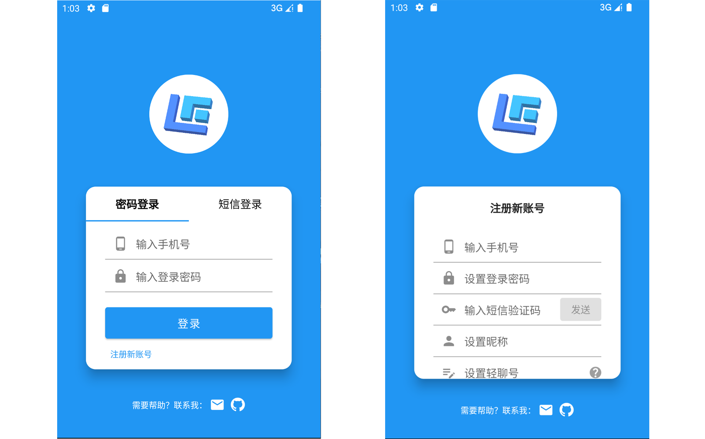
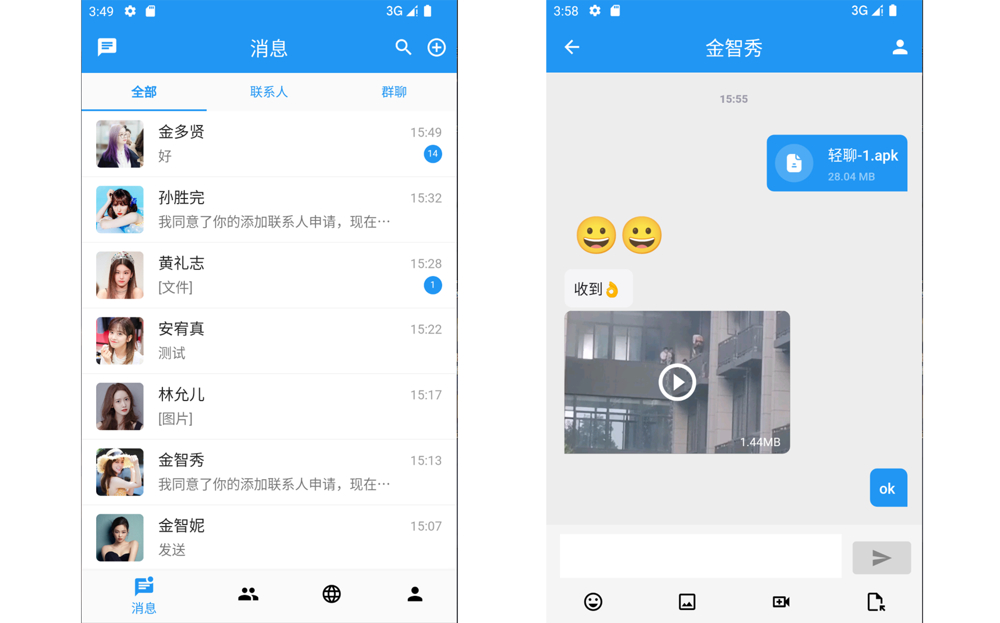
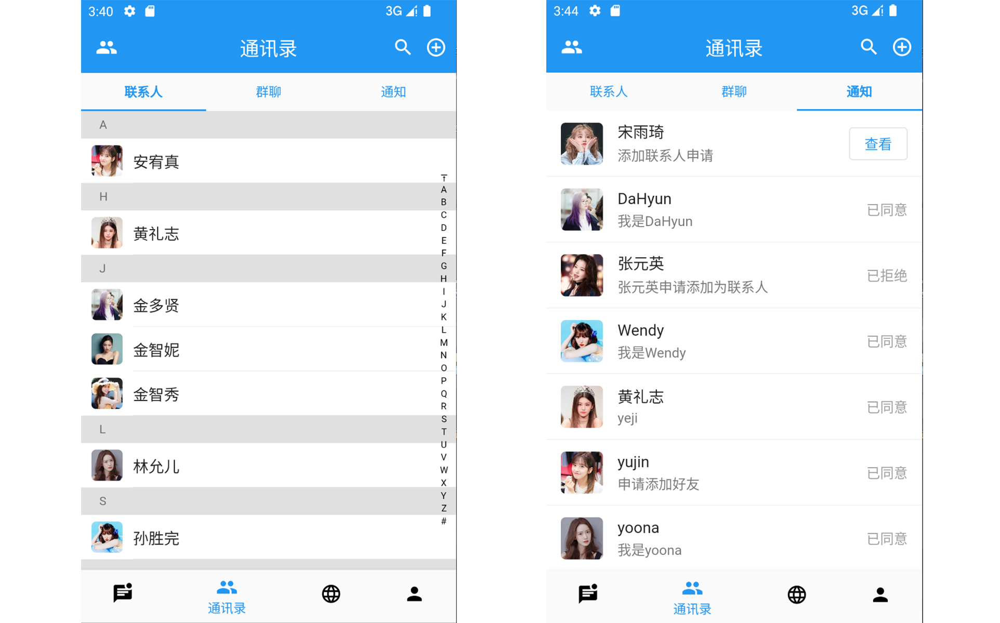
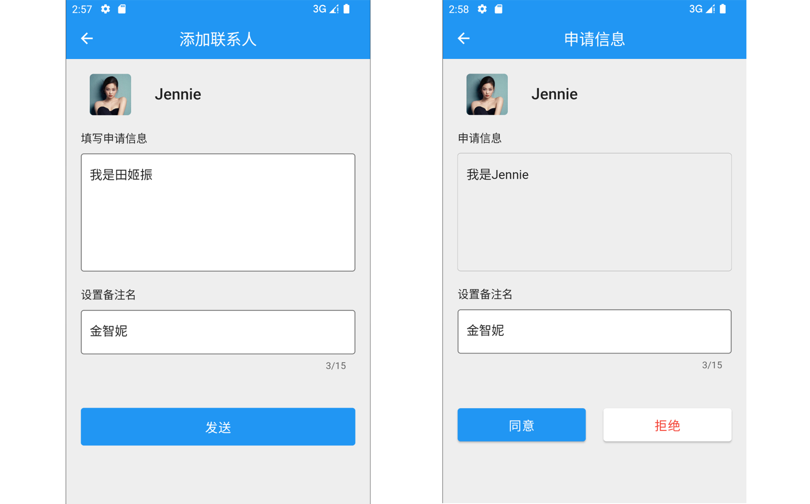
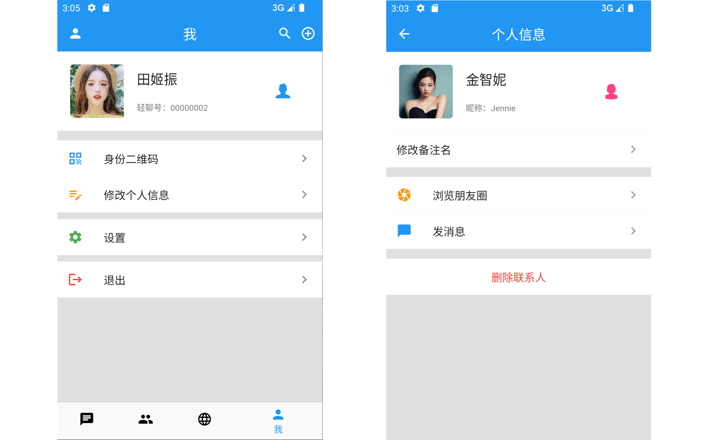
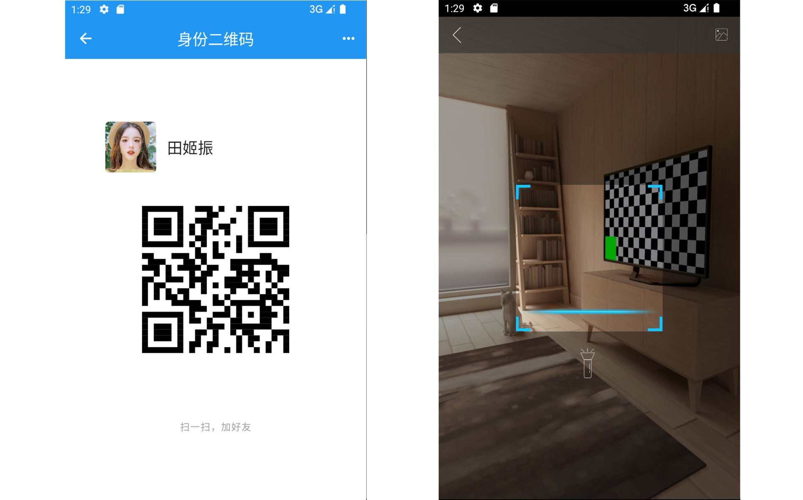
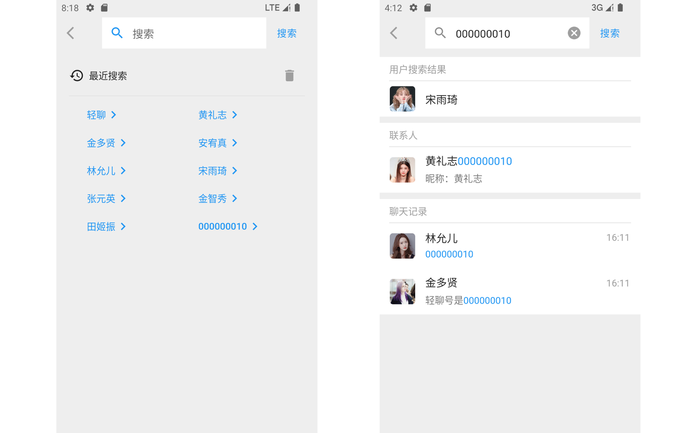

# LightChat APP

---

轻聊 APP 基于 Flutter 开发。

下载链接：[轻聊.apk](https://pan.xunlei.com/s/VNKYt2mbHm-g19zWBYnm63LsA1?pwd=ng98)

## 预览

* 登录和注册页面。支持密码登录、短信验证码登录。


<br>

* 消息列表和聊天页面。显示未读信息提示；支持发送并查看聊天文字、表情、图片、视频、文件。


<br>

* 联系人列表和联系人通知页面。支持昵称首字母索引跳转。


<br>

* 添加联系人申请和查看页面。


<br>

* 个人信息页面和用户信息页面。支持设置头像、昵称、性别等个人信息；支持更改联系人备注名、浏览联系人朋友圈、删除联系人等。


<br>

* 身份二维码页面和二维码扫描页面。支持将身份二维码保存到本地；扫描身份二维码会跳转到用户信息页面。


<br>

* 搜索和搜索结果页面。支持保存搜索记录；支持搜索用户、联系人、聊天记录。


<br>

* 朋友圈相关操作演示。支持发布、删除、点赞、评论、回复评论等，支持更换朋友圈封面。


<br>

## 调试

对于使用轻聊 APP，除了直接通过上方提供的下载链接下载轻聊 APP 进行使用之外，你也可以遵循以下步骤，在你的安卓手机或者模拟器上调试运行轻聊 APP。

### 1. 安装 Flutter

轻聊 APP 是完全基于 Flutter 开发的。请确保你的 PC 上已正确安装 Flutter。

安装请参考：[Install | Flutter](https://docs.flutter.dev/get-started/install)

### 2. 下载 LightChat APP 源码

在 PC 的任意目录下执行：
```shell
git clone https://github.com/heejinzzz/lightchat.git
```
会将 LightChat 源码下载到当前目录下的 lightchat 目录。

### 3. 修改服务端 host
将 `lightchat/lightchat_app/lib/config.dart` 文件中的 `"LightChat_Server_Host"` 修改为轻聊服务端所部署在的 host。

### 4. 进入 LightChat APP 主目录
执行：
```shell
cd lightchat/lightchat_app
```
进入轻聊 APP 主目录。

### 5. 调试运行
将你的 PC 连接上安卓手机或模拟器后，执行：
```shell
flutter pub get
flutter run
```
即可在手机上运行`debug`模式的轻聊APP。