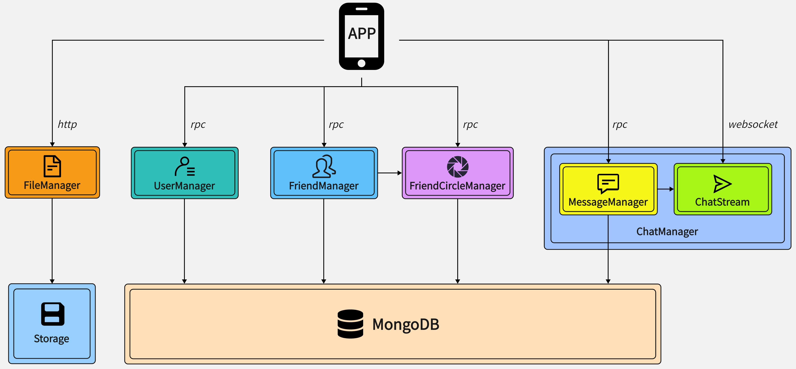
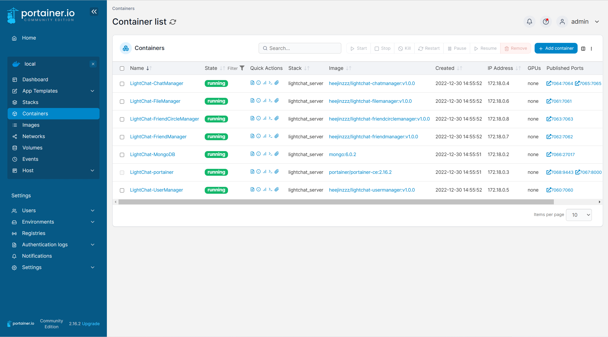

# LightChat Server

---

轻聊服务端基于 Go 语言编写，采用拆分式的微服务架构，使用 docker 容器式部署。

数据库存储选用 MongoDB 作为 DBMS。

## 架构



* ### 文件系统 FileManager
管理用户头像、朋友圈封面、朋友圈图片、聊天图片、聊天视频等文件。

* ### 用户管理系统 UserManager
管理用户id、密码、昵称、性别、手机号等用户信息。

* ### 好友管理系统 FriendManager
管理联系人关系、备注名、联系人添加、删除等信息。

* ### 朋友圈系统 FriendCircleManager
管理朋友圈内容信息以及朋友圈上传、删除、点赞、评论、回复等操作。
* ### 聊天系统 ChatManager
包括 **MessageManager** 和 **ChatStream** 两个模块，分别负责管理聊天记录信息、在线消息实时发送。

> 以上各服务的 API 列表可以在各自目录下的`docs/API.md`文件中查看

## 部署与卸载
遵循并完成以下步骤，你可以在你的服务器上部署或卸载轻聊服务端。

### 1. 申请开通腾讯云短信服务
轻聊支持使用短信验证码注册、登录。请先申请开通腾讯云短信服务。

开通腾讯云短信服务请参考：[国内短信快速入门](https://cloud.tencent.com/document/product/382/37745)

**短信内容申请配置：**
* 短信签名：轻聊LightChat
* 短信模板：
    * 注册验证码短信模板： 

          您的注册验证码为{1}，{2}分钟内有效。如非本人操作，请忽略此短信。

    * 登录验证码短信模板：

          您的登录验证码为{1}，{2}分钟内有效。如非本人操作，请忽略此短信。

提交短信签名和模板申请后，等待腾讯云审核通过。

### 2. 安装 docker 和 docker-compose
轻聊服务端是基于 docker 和 docker-compose 部署的。部署前请先确保你的服务器已安装 docker 和 docker-compose。

* docker 安装请参考：[Docker Engine installation overview](https://docs.docker.com/engine/install/)
* docker-compose 安装请参考：[Install the Compose plugin](https://docs.docker.com/compose/install/linux/)

### 3. 开放服务器端口
LightChat Server 各服务占用的端口如下：

|              服务               |  端口  |
|:-----------------------------:|:----:|
|     LightChat-UserManager     | 7060 |
|     LightChat-FileManager     | 7061 |
|    LightChat-FriendManager    | 7062 |
| LightChat-FriendCircleManager | 7063 |
|   LightChat-MessageManager    | 7064 |
|     LightChat-ChatStream      | 7065 |

部署前请确保以上端口保持对外开放且未被占用。

另外，为便于从外部访问数据或者监控容器状态，可以考虑开放以下两个端口：
* （可选）7066 端口。这是 LightChat-MongoDB 对外映射端口。开放此端口后，可以从外界连接 LightChat Server 中的 MongoDB 并访问其中的数据。
* （可选）7068 端口。这是 LightChat-portainer web 服务对外映射的端口。开放此端口后，你可以用浏览器访问 `https://${server_host}:7068`，监控各容器状态。如下图所示：


### 4. 下载 LightChat Server 源码：
在浏览器任意目录下，执行：
```shell
git clone https://github.com/heejinzzz/lightchat.git
```
会将 LightChat 源码下载到当前目录下的 lightchat 目录。

### 5. 配置短信服务信息
在`lightchat/lightchat_server/UserManager/handler`目录下的`UserManager.go`文件中，根据第一步申请短信服务后获得的配置信息，修改下面这段代码：

```go
const (
	SecretId           = "************************************"
	SecretKey          = "********************************"
	SmsSdkAppId        = "**********"
	SignName           = "轻聊LightChat"
	RegisterTemplateId = "*******"
	LoginTemplateId    = "*******"
)
```

以上各常量对应的配置为：

|        常量名         |                                               对应配置                                               |
|:------------------:|:------------------------------------------------------------------------------------------------:|
|      SecretId      |            在 [云API密钥](https://console.cloud.tencent.com/cam/capi) 上申请的标识身份的 SecretId             |
|     SecretKey      | 在 [云API密钥](https://console.cloud.tencent.com/cam/capi) 上申请获得的云API密钥，一个 SecretId 对应唯一的 SecretKey  |
|    SmsSdkAppId     |  短信 SdkAppId，在 [短信控制台](https://console.cloud.tencent.com/smsv2/app-manage) 添加应用后生成的实际 SdkAppId   |
|      SignName      |         申请的短信签名，签名信息可前往 [国内短信签名管理](https://console.cloud.tencent.com/smsv2/csms-sign) 查看         |
| RegisterTemplateId | 申请的注册验证码短信模板 ID，模板 ID 可前往 [国内短信正文模板管理](https://console.cloud.tencent.com/smsv2/csms-template) 查看 |
|  LoginTemplateId   | 申请的登录验证码短信模板 ID，模板 ID 可前往 [国内短信正文模板管理](https://console.cloud.tencent.com/smsv2/csms-template) 查看 |

### 6. 进入 LightChat Server 目录
执行：
```shell
cd lightchat/lightchat_server
```
进入 LightChat Server 主目录。

### 7. 部署
执行部署脚本：
```shell
bash deploy.sh
```
执行完成后，轻聊服务端就成功部署在了你的服务器上。

### 8. 卸载
同样在此目录下，执行卸载脚本：
```shell
bash undeploy.sh
```
执行完成后，轻聊服务端成功被卸载。相关的容器、镜像、数据都会被删除。